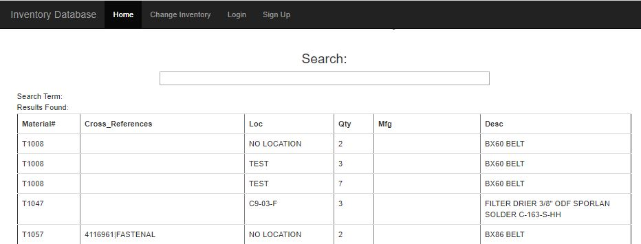
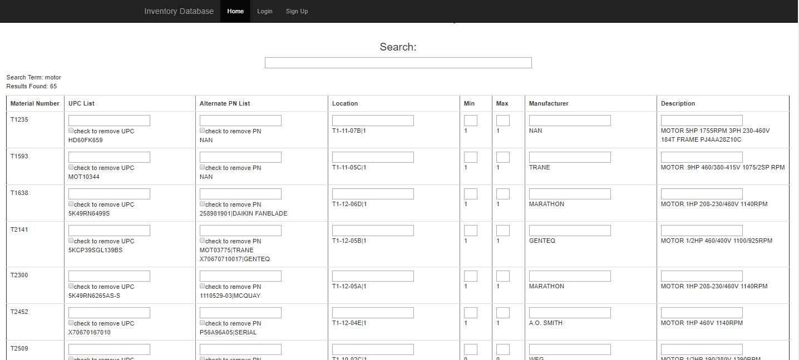

# Inventory-Web-Application
Web App using flask boostrap to view and change inventory data.

BOOTSTRAP TEMPLATE USED FOR LOGIN PROFILE

SQLITE DATABASE USED TO STORE INVENTORY.  DATA IS PARSED AND DISPLAYED ON THE SCREEN IN 'VIEW MODE' ON THE HOMEPAGE.

TO CHANGE INVENTORY YOU MUST LOGIN AND NAVIGATE TO 'DASHBOARD'.  UPDATES IN REALTIME AND VIEWABLE ON A MOBILE DEVICE.

TO RUN APP:
CLONE GIT REPOSITORY
OPEN CONSOLE / BASH AND NAVIGATE TO DIRECTORY
INPUT INTO CONSOLE:PYTHON APP.PY 
NAVIGATE TO: ...
HTTP://LOCALHOST:5000
... IN WEB BROWSER

